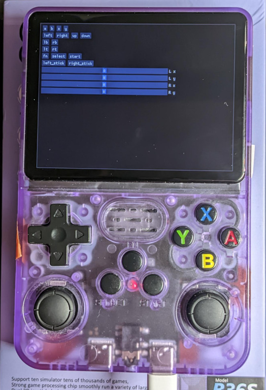

# Cross-compiling for JELOS/Rocknix



Cross-compiling is done using a docker container, running an image containing the JELOS/Rocknix toolchain: https://github.com/Simon-L/jelos-toolchain/

The setup is done in three step:

1. Build lua for the host
1. Build lua and luarocks for the target into a self-contained environment ready to be deployed to the target.
1. Install required lua modules using luarocks, taking care of cross-compiling for the target.
1. Build the imgui lua binding module

## Build steps

#### 1 - Build lua for the host
```bash
docker run --rm -ti -w /build -v $(pwd):/build \
    justenoughlinuxos/jelos-toolchain:RK3326-aarch64 \
    bash -c 'python ./hererocks/hererocks.py host_dir -j @v2.1 --verbose'
```

#### 2 - Build lua and luarocks for the target
`mkdir target_dir` first and then:
```bash
docker run --rm -ti -w /build -v $(pwd):/build -v $(pwd)/target_dir:/storage/target_dir \
    justenoughlinuxos/jelos-toolchain:RK3326-aarch64 \
    bash -c 'SSL_CERT_DIR=/etc/ssl/certs CROSS=aarch64-jelos-linux-gnueabi- python ./hererocks/hererocks.py /storage/target_dir -j @v2.1 -rlatest --verbose'
```
Specifically for JELOS/Rocknix, the target directory is mounted as another volume where it is expected to be on the actual target filesystem, namely in `/storage`, the only read-write part of the system. This is optional and only to avoid having to change paths at runtime.

#### 3 - Add lua modules using luarocks

We then use the host lua to run luarocks (which is a lua script!) against the target tree. $CC is set in the docker container and used by luarocks for cross-compiling modules for the target arch.

Here is a little suggestion of rocks that rock for everyday lua :) :
```bash
docker run --rm -ti -w /build -v $(pwd):/build -v $(pwd)/target_dir:/storage/target_dir \
    justenoughlinuxos/jelos-toolchain:RK3326-aarch64 \
    bash -c 'host_dir/bin/lua /storage/target_dir/bin/luarocks --tree "/storage/target_dir" install penlight && \
    host_dir/bin/lua /storage/target_dir/bin/luarocks --tree "/storage/target_dir" install inspect && \
    host_dir/bin/lua /storage/target_dir/bin/luarocks --tree "/storage/target_dir" install luaposix && \
    wget https://github.com/rxi/json.lua/raw/master/json.lua -O /storage/target_dir/share/lua/5.1/json.lua'
```

#### 4 - Build the imgui module and its dependencies
```bash
docker run --rm -ti -w /build -v $(pwd):/build -v $(pwd)/target_dir:/storage/target_dir \
    justenoughlinuxos/jelos-toolchain:RK3326-aarch64 \
    bash build_imgui.sh /storage/target_dir
```
Copy `minimal_sdl_gl31`.lua to the device and you may then run it directly over SSH for example using:
`LD_LIBRARY_PATH=/storage/target_dir/lib/lua/5.1/ /storage/target_dir/bin/lua minimal_sdl_gl31.lua`